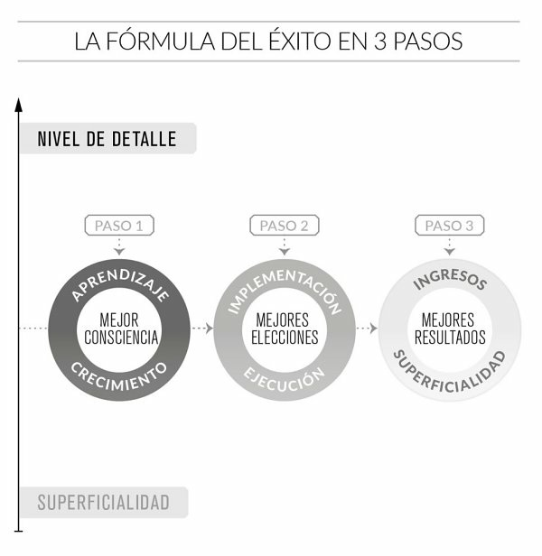
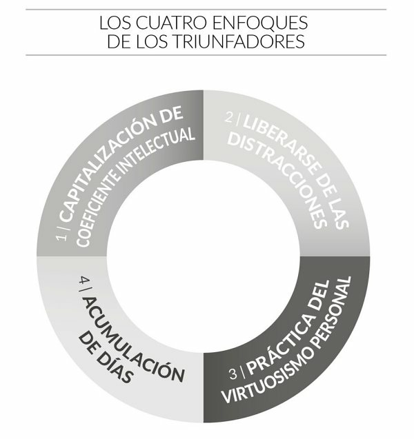
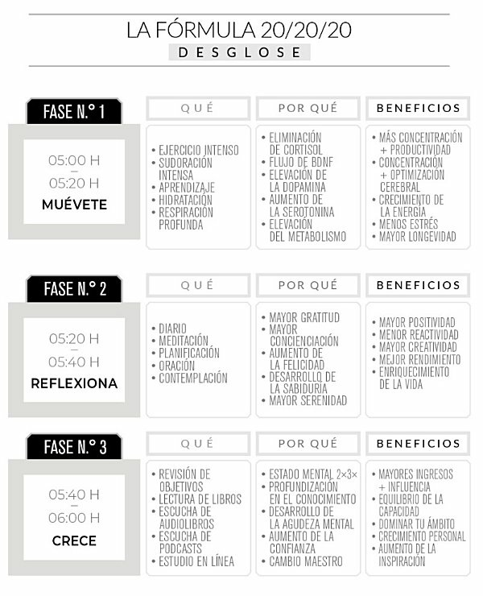

## El club de las 5am - Robin Sharma

***«Controla tus mañanas, impulsa tu vida».***

***“La vida de primera clase empieza donde termina tu zona de confort”***

***“El momento en que más deseas abandonar es el
instante en que debes encontrar la fuerza en tu interior para seguir adelante”***

***“Haz posible lo imposible”***

***“Hecho es mejor que perfecto”***

*Isaac Asimov escribió: **«La educación autodidacta es, creo firmemente, el único tipo de educación que existe”***

***“El dolor es la puerta hacia la profundidad”***

*Sócrates decía: **«La educación es encender una llama».***

*Norman Cousins: **«La tragedia de la vida no es la muerte, sino que nos dejamos morir por
dentro mientras aún estamos vivos».***

***«Todo cambio es duro al principio, desordenado a la mitad y precioso al final».***

*Martin Luther King, Jr. dijo: **«Todo el mundo puede ser grande… porque cualquiera puede servir. No hace falta un título universitario para servir. No hace falta hacer concordar el sujeto con el predicado para servir. Solo hace falta un corazón lleno de
gracia. Un alma creada por el amor».***

*Epicteto, uno de mis filósofos favoritos, escribió: **«Mas un toro no se hace tal de repente, ni tampoco un hombre se hace hidalgo, sino que antes hay que encerrarse,
prepararse y tirarse uno de ligero a lo que no le cuadra».***

***“Es bueno levantarse antes del amanecer, porque tales hábitos contribuyen a la salud, riqueza y sabiduría”** Aristóteles.*

***«La única manera de lidiar con este mundo sin libertad es volverte tan absolutamente libre que tu mera existencia sea un acto de rebelión»** Albert Camus.*

***«La comparación es el ladrón de la felicidad»***

***«liderar significa servir».***

### Reglas de exito
>   EL **liderazgo** consiste en resistir a la tiranía de lo ordinario, en
    impedir que la negatividad se apropie de vuestra capacidad de asombro
    y en evitar que cualquier forma de esclavitud de la mediocridad infeste
    vuestras vidas. El liderazgo consiste en marcar la diferencia justo desde
    donde estáis. El verdadero liderazgo consiste en aportar al mundo un
    trabajo valiente de genialidad ejemplar, con un alcance, una innovación
    y una ejecución que pongan todo vuestro mundo patas arriba, y que sea
    tan asombrosamente sublime que sobreviva a la prueba del tiempo.
    

**REGLA N.º 1**

La adicción a la distracción es el fin de tu producción creativa. Los
creadores de imperios y los que escriben la historia dedican una
hora a sí mismos antes del amanecer, en la serenidad que escapa a
las garras de la complejidad, y se preparan para un día de primera.

**REGLA N.º 2**

Las excusas no crean ningún genio. Que no hayas adoptado el
hábito de levantarte temprano antes no significa que no puedas
hacerlo ahora. Deshazte de todo el raciocinio y recuerda que las
pequeñas mejoras diarias, si se hacen de forma constante,
conllevan con el tiempo unos resultados asombrosos.

**REGLA N.º 3**

Todo cambio es duro al principio, desordenado a la mitad y
precioso al final. Todo lo que ahora te parece fácil, al principio te
pareció difícil. Con una práctica constante, levantarte con el sol se
convertirá en algo normal y automático para ti.

**REGLA N.º 4**

Para obtener los resultados de la élite del 5 %, debes empezar a
hacer lo que el 95 % de la gente está poco dispuesta a hacer.
Cuando empieces a vivir así, la mayoría te dirá que estás loco.
Recuerda que el precio de la grandeza es ser etiquetado de
extravagante.

**REGLA N.º 5**

Cuando tengas ganas de rendirte, continúa. El triunfo ama a los
implacables.

### Formula del exito

Si mejoráis vuestra consciencia diaria, podéis tomar mejores decisiones cada día, y con mejores decisiones diarias empezarás a obtener mejores resultados regularmente.

### Cuatro enfoques del triunfo

>“Aceptad pocas invitaciones. Centraros en pocas actividades de ocio y,
después de estudiar las posibles opciones, elegid un número de libros
limitado, en vez de leer unas cuantas páginas de muchos. La intensa
concentración solo en lo que realmente importa es la clave de quienes logran
la victoria”.

**Capitalización de coeficiente intelectual**

Una persona no se hace legendaria por su talento natural innato, sino por su capacidad de materializarlo y capitalizarlo al máximo.

**Liberarse de las distracciones**

La adicción a la distracción es la muerte de producción creativa. → *Estado de fluidez.*

**Práctica del virtuosismo personal**

Cualquier cosa que hacéis en el mundo exterior es consecuencia directa de lo
que sucede en vuestro interior. Eso es lo realmente importante en la
preparación de la mañana. → *Disposición mental, la emocional, la física y la espiritual.*

**Acumulación de días**

Unos pocos cambios en la navegación, en apariencia irrelevantes e infinitesimales realizados de manera sistemática a lo largo de
un viaje prolongado.

### Formula del 20/20/20

La capacidad de levantarse temprano realmente deriva de la aplicación
diaria de la Fórmula 20/20/20

En términos simples, **un ejercicio intenso** que os haga sudar como primer componente todas las mañanas revolucionará la calidad de vuestros días. La segunda fase os **anima a reflexionar durante los siguientes veinte minutos.** Y terminaréis con vuestra Hora de la victoria para el
**fortalecimiento personal** con veinte minutos de crecimiento.