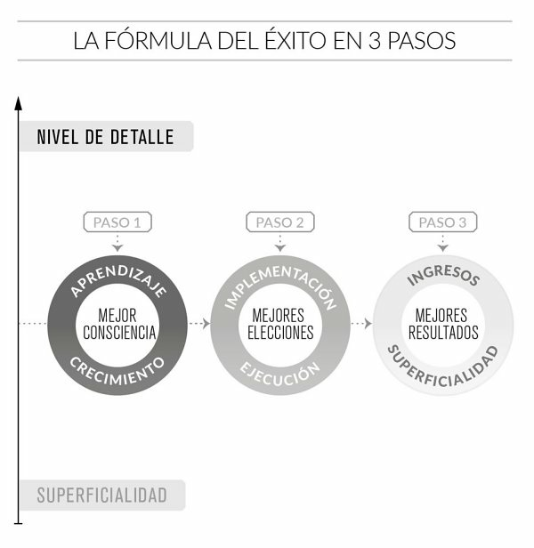
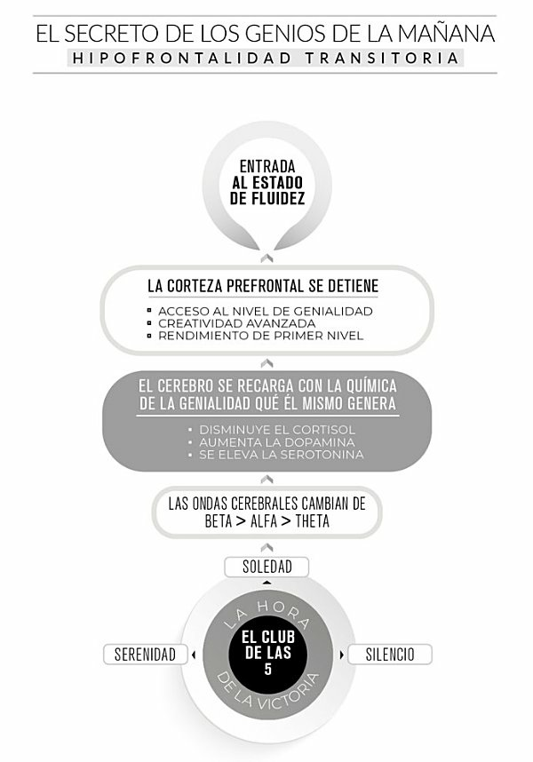
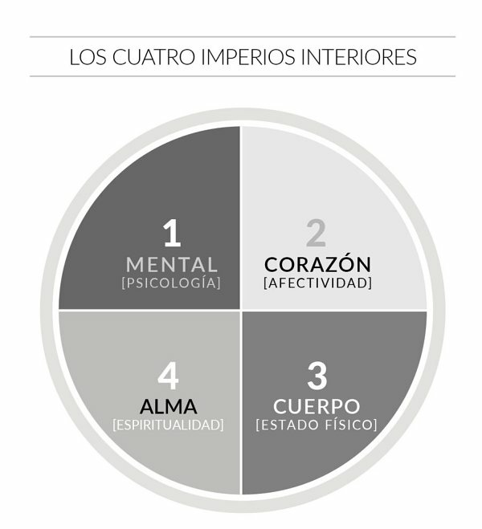
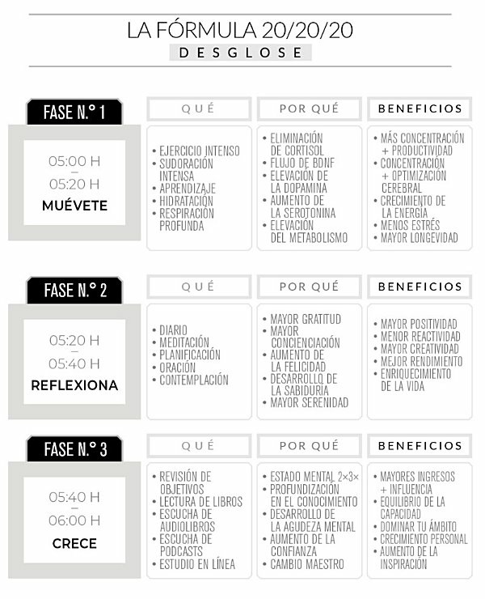
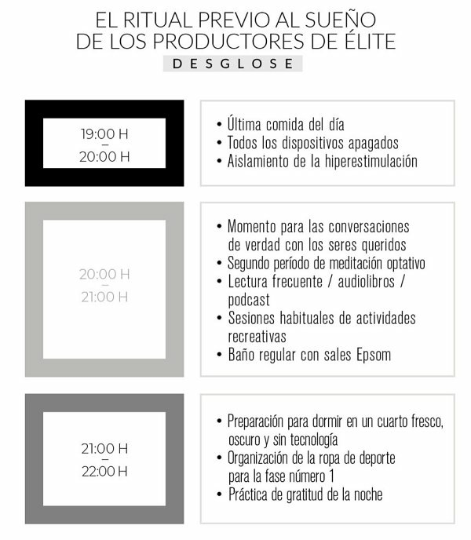
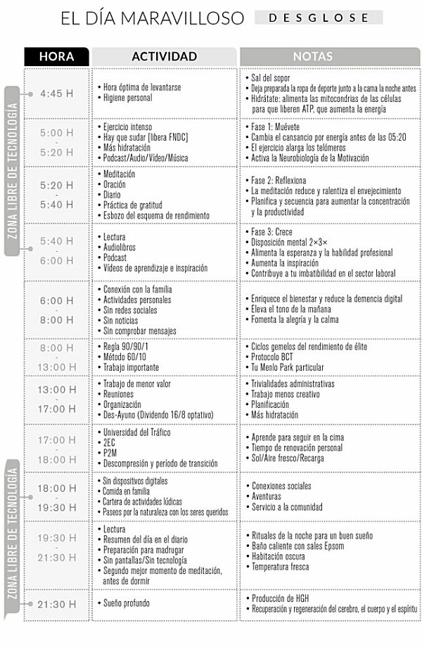
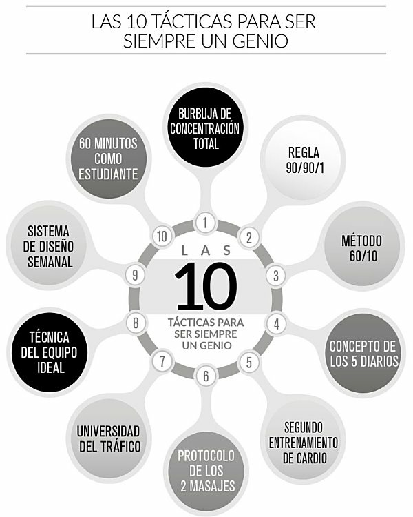
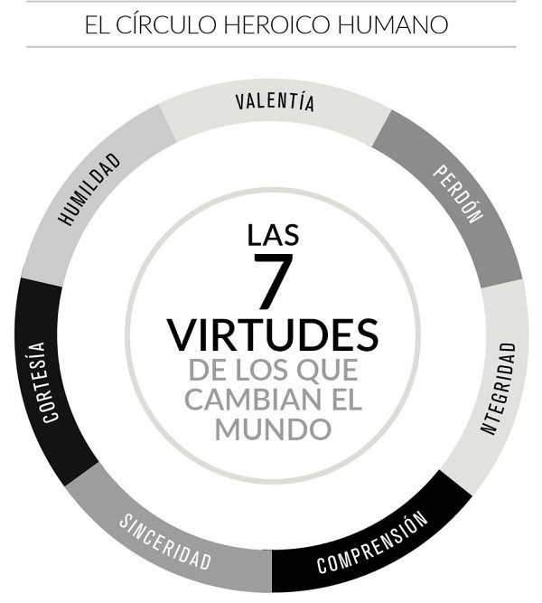

# El club de las 5am - Robin Sharma

***«Controla tus mañanas, impulsa tu vida».***

***“La vida de primera clase empieza donde termina tu zona de confort”***

_**“El momento en que más deseas abandonar es el instante en que debes encontrar la fuerza en tu interior para seguir adelante”**_

***“Haz posible lo imposible”***

***“Hecho es mejor que perfecto”***

*Isaac Asimov escribió: **«La educación autodidacta es, creo firmemente, el único tipo de educación que existe”***

***“El dolor es la puerta hacia la profundidad”***

*Sócrates decía: **«La educación es encender una llama».***

_Norman Cousins: **«La tragedia de la vida no es la muerte, sino que nos dejamos morir por dentro mientras aún estamos vivos».**_

***«Todo cambio es duro al principio, desordenado a la mitad y precioso al final».***

_Martin Luther King, Jr. dijo: **«Todo el mundo puede ser grande… porque cualquiera puede servir. No hace falta un título universitario para servir. No hace falta hacer concordar el sujeto con el predicado para servir. Solo hace falta un corazón lleno degracia. Un alma creada por el amor».**_

_Epicteto, uno de mis filósofos favoritos, escribió: **«Mas un toro no se hace tal de repente, ni tampoco un hombre se hace hidalgo, sino que antes hay que encerrarse, prepararse y tirarse uno de ligero a lo que no le cuadra».**_

***“Es bueno levantarse antes del amanecer, porque tales hábitos contribuyen a la salud, riqueza y sabiduría”** Aristóteles.*

***«La única manera de lidiar con este mundo sin libertad es volverte tan absolutamente libre que tu mera existencia sea un acto de rebelión»** Albert Camus.*

***«La comparación es el ladrón de la felicidad»***

***«liderar significa servir».***

## Guide

- [El club de las 5am - Robin Sharma](#el-club-de-las-5am---robin-sharma)
  - [Guide](#guide)
  - [Filosfia de vida](#filosfia-de-vida)
  - [Deshacerse de la mediocridad y todo lo ordinario](#deshacerse-de-la-mediocridad-y-todo-lo-ordinario)
  - [La cima de la productividad](#la-cima-de-la-productividad)
    - [Reglas de exito](#reglas-de-exito)
  - [La preparacion para el exito](#la-preparacion-para-el-exito)
  - [El club de las 5 am](#el-club-de-las-5-am)
  - [Un sistema para la grandeza](#un-sistema-para-la-grandeza)
  - [Cuatro enfoques del triunfo](#cuatro-enfoques-del-triunfo)
    - [Capitalización de coeficiente intelectual](#capitalización-de-coeficiente-intelectual)
    - [Liberarse de las distracciones](#liberarse-de-las-distracciones)
    - [Práctica del virtuosismo personal](#práctica-del-virtuosismo-personal)
    - [Acumulación de días](#acumulación-de-días)
  - [Navegando por la vida](#navegando-por-la-vida)
  - [Formula del 20/20/20](#formula-del-202020)
  - [Dormir es imprescindible](#dormir-es-imprescindible)
  - [Las 10 tacticas del ingenio](#las-10-tacticas-del-ingenio)
    - [Táctica número 1](#táctica-número-1)
    - [Táctica número 2](#táctica-número-2)
    - [Táctica número 3](#táctica-número-3)
    - [Tactica numero 4](#tactica-numero-4)
    - [Tactica numero 5](#tactica-numero-5)
    - [Tactica numero 6](#tactica-numero-6)
    - [Táctica número 7](#táctica-número-7)
    - [Táctica número 8](#táctica-número-8)
    - [Táctica número 9](#táctica-número-9)
    - [Tactica numero 10](#tactica-numero-10)
  - [Virtudes del circulo heroico](#virtudes-del-circulo-heroico)

## Filosfia de vida

La seducción de la complacencia y de una vida fácil es cien veces más cruel que una vida en la que lo das todo y adoptas una postura inquebrantable para conseguir tus mayores sueños.

El lugar donde reside el mayor de vuestros desasosiegos es a la vez el rincón donde se encuentra vuestra mayor oportunidad. Las creencias que os inquietan, los sentimientos que os amenazan, los proyectos que os enervan y el desarrollo
de vuestros talentos a los que se resiste esa parte insegura de vosotros mismos son justamente los lugares hacia donde 
debéis avanzar.

## Deshacerse de la mediocridad y todo lo ordinario

Tu entorno moldea realmente aquello que percibes, haces y te inspira. El arte alimenta mi alma. Los buenos libros blindan mi esperanza. Las conversaciones profundas aumentan mi creatividad. La música deliciosa eleva mi corazón. Las vistas hermosas fortalecen mi espíritu.

> La"Y tengo que decir que inspirar a la humanidad es la labor sublime a la que se dedica la élite del 5 % del mundo de los negocios. El auténtico propósito del asunto no es solo ganar tu propia fortuna. La verdadera razón de participar en este juego es poder ser útil a la sociedad. En los negocios, me centro sobre todo en servir. El dinero, el poder y el prestigio no son más que las consecuencias que inevitablemente me he ido encontrando por el camino."

_«Por mi parte, no sé nada con certeza, pero la visión de las estrellas me hace soñar»_

El **sufrimiento** aporta muchas recompensas, como la empatía, la originalidad, el don de gentes y la autenticidad.Elimina la falsedad, el miedo y la arrogancia que provienen del ego.

_«La mayor victoria se consigue en esas horas tempranas de la mañana, cuando nadie te mira y mientras todos duermen»_

>En una cultura de zombis cibernéticos adictos a la distracción y afligidos por la interrupción, el modo más sabio de garantizar la producción de resultados del más alto nivel en las áreas más importantes de vuestra vida profesional y personal es establecer una rutina matinal de gran calidad. La victoria comienza en vuestro principio. Y vuestras primeras horas son el momento en que se forjan los héroes. Declarad la guerra a la debilidad y lanzad una campaña contra el miedo. Podéis levantaros temprano. Hacerlo es una necesidad en vuestra búsqueda formidable de lo legendario. Poned un cuidado excelente a la parte inicial del día, y el resto del día se arreglará por sí solo. Controlad vuestras mañanas, impulsad vuestra vida.

El éxito colosal no depende tanto de la genética heredada como de los hábitos diarios. Y el ritual de la mañana es, con diferencia, el más importante que debéis calibrar.

>Levantarse a las 5 de la mañana es sin duda la Madre de todas las rutinas. Unirse al Club de las 5 de la mañana es el único comportamiento humano que se erigirá sobre todos los demás. Este régimen es el motor definitivo que os convertirá en un modelo imbatible de capacidad. El modo en que comienzas el día determina el grado de concentración, energía, entusiasmo y excelencia de los que dispondréi.

Elevarte como persona es uno de los modos más inteligentes de pasar el resto de tu vida. Cada desafío conlleva la valiosa oportunidad de pasar a un nuevo nivel como líder, persona productiva y ser humano. Los obstáculos no son más que pruebas diseñadas para medir hasta qué punto deseas realmente las recompensas que tu ambición busca. Aparecen para determinar en qué medida estás dispuesto a mejorar para convertirte en el tipo de persona que puede ostentar todo ese éxito.

>«Todo cambio es duro al principio, desordenado a la mitad y precioso al final».

_La verdad es esta: la mayoría de la gente del planeta no piensan mucho en ellos mismos, por desgracia. Protegen su identidad con su forma de ser externa. Valoran sus logros a partir de lo que han ganado en lugar de tener en cuenta la personalidad que han cultivado. Se comparan a sí mismos con los ejemplos orquestados (y falsos) de la gente a la que siguen. Miden su valía a partir de lo que vale su red. Y son secuestrados por la falsa idea de que, cualquier cosa que no se haya hecho nunca, no se puede hacer, agotando de este modo las enormes y estimulantes posibilidades que sus vidas están destinadas a brindarles._

Sed virtuosos. Destacad. Buscad la excepcionalidad. **La élite del 5 % está mucho menos preocupada por la fama, el dinero y la aprobación e invierte mucho más en pelear por encima de su peso, en explotar al máximo sus dones y en crear el tipo de productividad que inspire, y ayude, a millones de personas.** Es por eso que suelen ganar millones. Así que no actuéis sin pensar, de un modo automático. Generad vosotros el cambio.

El modo en que comienzas el día determina el grado de concentración, energía, entusiasmo y excelencia de los que dispondréis. **Cada mañana es una página en la historia** que se convierte en vuestro legado. Cada nuevo amanecer es una nueva oportunidad para desatar vuestra genialidad, para liberar vuestra potencia y para jugar en las mejores ligas con resultados de superestrella.

Mostrad **respeto y compasión** por todo el mundo que ocupa este planeta diminuto, independientemente de su credo o de su color. Elevaos en medio de una civilización en la que muchos hacen acopio de energía para derribar al prójimo. Ayudad a los demás a sentir las maravillas que duermen en vuestro interior.

## La cima de la productividad

_Tu tiempo es limitado, no lo malgastes viviendo la vida de
alguien distinto. No te quedes atrapado en el dogma, eso es
vivir como otros piensan que deberías vivir. No dejes que los
ruidos de las opiniones de los demás acallen tu propia voz
interior. Y, lo que es más importante, ten el coraje para
seguir a tu corazón y tu intuición. Ellos ya saben de algún
modo en qué quieres convertirte realmente. **Steve Jobs**_

### Reglas de exito

>  EL **liderazgo** consiste en resistir a la tiranía de lo ordinario, en impedir que la negatividad se apropie de vuestra capacidad de asombro y en evitar que cualquier forma de esclavitud de la mediocridad infeste vuestras vidas. El liderazgo consiste en marcar la diferencia justo desde donde estáis. El verdadero liderazgo consiste en aportar al mundo un trabajo valiente de genialidad ejemplar, con un alcance, una innovación y una ejecución que pongan todo vuestro mundo patas arriba, y que sea tan asombrosamente sublime que sobreviva a la prueba del tiempo.

**REGLA N.º 1**

La adicción a la distracción es el fin de tu producción creativa. Los creadores de imperios y los que escriben la historia dedican una hora a sí mismos antes del amanecer, en la serenidad que escapa a las garras de la complejidad, y se preparan para un día de primera.

**REGLA N.º 2**

Las excusas no crean ningún genio. Que no hayas adoptado el
hábito de levantarte temprano antes no significa que no puedas
hacerlo ahora. Deshazte de todo el raciocinio y recuerda que las pequeñas mejoras diarias, si se hacen de forma constante,
conllevan con el tiempo unos resultados asombrosos.

**REGLA N.º 3**

Todo cambio es duro al principio, desordenado a la mitad y
precioso al final. Todo lo que ahora te parece fácil, al principio te pareció difícil. Con una práctica constante, levantarte con el sol se convertirá en algo normal y automático para ti.

**REGLA N.º 4**

Para obtener los resultados de la élite del 5 %, debes empezar a hacer lo que el 95 % de la gente está poco dispuesta a hacer. Cuando empieces a vivir así, la mayoría te dirá que estás loco. Recuerda que el precio de la grandeza es ser etiquetado de extravagante.

**REGLA N.º 5**

Cuando tengas ganas de rendirte, continúa. El triunfo ama a los implacables.

## La preparacion para el exito

El poder verdadero y perdurable se expresa cuando tomas contacto con tus dones originales y cuando llevas a la práctica tus talentos más espléndidos como ser humano.

El servicio. Lo que los empresarios llamarían «desbloquear el valor del accionista». Como dije en mi seminario antes de caer al suelo, **«liderar significa servir»**. El filósofo sufí Rumi lo dijo de un modo mucho más brillante cuando observó: «Renuncia a la gota, conviértete en el océano».

La inspiración se alimenta del aislamiento, lejos de la distracción digital incesante y del exceso salvaje de comunicación que domina las horas de la mayoría de la gente.

## El club de las 5 am

>Tener mucho dinero no te hace diferente, solo te recuerda quién eras antes de hacer dinero.

Protegerse contra la distracción es algo muy necesario si queréis dominar en vuestro campo y cosechar el éxito en vuestro arte. Los neurocientíficos llaman «fluidez».

_El club de las 5am me permitió convertirme en un pensador visionario. Me dio un espacio de reflexión para desarrollar una vida interior formidable. La disciplina me ayudó a estar excepcionalmente en forma, con todos los hermosos beneficio y las mejoras en el estilo de vida que conlleva tener una buena salud. Levantarme temprano también me convirtió en un líder asombroso. Y me ayudó a convertirme en una mejor persona.Incluso cuando el cáncer de próstata intentó arruinarme, fue mi rutina matinal lo que me aisló._

## Un sistema para la grandeza

El Método de las **5 de la mañana** en vuestra rutina matinal aumentará vuestra productividad, lograréis elevaros por encima de la comunidad de la superficialidad que domina actualmente el planeta y entraréis en la sociedad del nivel de detalle. Este nivel superior de información y consciencia mejorará vuestras decisiones diarias. Y, lógicamente, una vez que toméis las decisiones correctas a diario, aceleraréis enormemente vuestro liderazgo, vuestra realización y vuestro impacto.

_El principio de la transformación es el aumento de la percepción. Cuanto más ves, más puedes materializar. Y cuanto más sabes, más puedes conseguir. Las mujeres y los hombres geniales del mundo —los responsables de las sinfonías mágicas, los movimientos hermosos, los avances de la ciencia y el progreso de la tecnología— comenzaron rediseñando su modo de pensar y reinventando su consciencia. De este modo, entraron en un universo secreto que la mayoría no podía percibir. Y esto, a su vez, les permitió tomar las decisiones diarias que pocos toman. Y estas decisiones les permitieron obtener los resultados diarios que pocos logran._

>Aplican una mentalidad que se centra en el nivel de detalle en lugar de en el superficial

La élite del 5 % trabaja grano a grano, con un
gran nivel de detalle en lugar de aplicar una mentalidad superficial a sus actitudes, sus comportamientos y sus actividades del día a día.

Las pequeñas cosas importan cuando se trata de alcanzar la perfección. 

>Los maestros de la perfección son extraordinariamente detallistas. Piensan atentamente en lo que hacen.

Cuando analizas el modo en que las superestrellas, los virtuosos y los genios lograron el éxito, te das cuenta de que fue su elevada consciencia para detectar las oportunidades diarias de grandeza lo que les inspiró para tomar las mejores decisiones a diario que les aportaron los mejores resultados.

_A medida que vayáis tomando consciencia de las nuevas ideas, creceréis como productores y como personas. A medida que elevéis vuestro desarrollo personal y profesional, el nivel al que implementáis y ejecutáis vuestras mayores ambiciones aumentará. Y, por supuesto, vuestra habilidad para hacer realidad vuestros sueños y visiones se incrementará y seréis recompensados con mayores ingresos y con un impacto más alto._

>Arriésgalo todo por amor, si verdaderamente eres un ser humano. Si no, márchate de esta reunión. Las medias tintas no alcanzan la majestuosidad.

Si mejoráis vuestra consciencia diaria, podéis tomar mejores decisiones cada día, y con mejores decisiones diarias empezarás a obtener mejores resultados regularmente.

Un perfeccionismo sano, y una firme búsqueda para ser la mejor versión de vosotros mismos; todo eso es lo que os ofrezco a los dos en esta playa asombrosa. La constancia es realmente el ADN de la perfección. Y los pequeños cambios, por insignificantes que parezcan, a la larga dan resultados espectaculares.

>Pequeñas victorias y repeticiones diarias se van apilando y, a largo plazo, aportan resultados excelentes.

## Cuatro enfoques del triunfo

Pensar en la muerte ayuda a focalizar con mayor exactitud aquello que realmente importa. Es importante dejar de permitir que las distracciones digitales, las diversiones informáticas y las interacciones en línea continúen robándonos las irremplazables horas que deberíamos dedicar a esa bendición llamada vida.

>“Aceptad pocas invitaciones. Centraros en pocas actividades de ocio y, después de estudiar las posibles opciones, elegid un número de libros limitado, en vez de leer unas cuantas páginas de muchos. La intensa concentración solo en lo que realmente importa es la clave de quienes logran la victoria”.

Mostrad gratitud por cada instante de vuestras vidas. No debéis ser tímidos con respecto a vuestras ambiciones. Dejad de perder el tiempo o de dedicarlo a trivialidades sin sentido. Vuestra prioridad debe ser aprovechar la creatividad, ese fuego y ese potencial que están latentes dentro de cada uno.

### Capitalización de coeficiente intelectual

Una persona no se hace legendaria por su talento natural innato, sino por su capacidad de materializarlo y capitalizarlo al máximo.

>«La única manera de lidiar con este mundo sin libertad es volverte tan absolutamente libre que tu mera existencia sea un acto de rebelión».

>»La dedicación y la disciplina ofrecen mejores resultados que la brillantez y el talento innato en el día a día. Y no es que los que juegan en primera división tengan suerte. Es que consiguen esa suerte.

>«Las víctimas tienen televisiones enormes. Los líderes poseen grandes bibliotecas».

La consecución de la excelencia es un proceso, no un hecho aislado. Abordar un programa psicológico castrante, basado en afirmaciones tales como «no todas las personas pueden llegar a ser grandes» o «el talento es innato, no se desarrolla»

Nos convertimos en lo que nos rodea. Y tú
nunca recibirás una influencia positiva en tu campo, ni lograrás que tu vida
sea plena si te rodeas de personas negativas. 

Las personas que consiguen grandes resultados y que contribuyen a construir el mundo no están muy disponibles para quienes requieren su atención y tiempo. Es difícil establecer contacto con ellos y son los que generan los asombrosos resultados que hacen que nuestro mundo progrese.

Asumimos así el paradigma de la víctima. Creamos escusas y las repetimos una y otra vez hasta convencer a nuestro subconsciente de que son ciertas. Culpamos a otras personas o a las condiciones externas de nuestras dificultades y atribuimos a episodios pasados la responsabilidad de nuestras batallas personales.

Cada vez que te das cuenta de que has caído en una mentalidad victimista y decides optar por una decisión más valiente, _estás reescribiendo tu historia. Así mejoráis vuestra identidad, aumentáis el respeto que os tenéis y enriquecéis la confianza en vosotros mismos._ Cada vez que votáis por el ser superior que hay en vosotros aplacáis vuestro lado más débil y alimentáis vuestra capacidad intrínseca. Y cuando lo hagáis con la uniformidad que demandan la experiencia y el dominio de las situaciones, vuestra **«Capitalización de coeficiente intelectual», es decir, la capacidad para materializar cualquiera de los dones con los que habéis nacido, no hará más que aumentar.**

### Liberarse de las distracciones

La adicción a la distracción es la muerte de producción creativa.

Igualmente, desde el punto de vista social, es preferible tener pocos amigos, pero profundizar en la relación con ellos, de forma que esta sea más fecunda. Aceptad pocas invitaciones. Centraros en pocas actividades de ocio y, después de estudiar las posibles opciones, elegid un número de libros limitado, en vez de leer unas cuantas páginas de muchos. La intensa concentración solo en lo que realmente importa es la clave de quienes logran la victoria. Simplificad. Simplificad. Simplificad.

_Uno de los rasgos más fascinantes de nuestro cerebro primitivo es su sesgo de negatividad. Para mantenernos seguros, está menos interesado en lo que es positivo en nuestro entorno, mientras que se centra de manera más significativa en hacernos saber lo que es malo. Cuando abandonamos nuestra zona de confort, el cerebro primitivo entra en acción. Cuando incrementamos nuestros conocimientos y nuestra experiencia y elevamos nuestro nivel de influencia, se atemoriza ante los inminentes cambios._

>«La comparación es el ladrón de la felicidad. Siempre hay alguien que tiene más fortuna, más fama o más cosas que tú. Recordad cuando antes hablábamos de lo beneficioso del desapego por los bienes y de ser lo bastante juicioso para saber cuándo lo suficiente es adecuado.»

La soledad, el tipo de soledad al que se puede tener acceso antes de que salga el sol, es una fuerza multiplicadora de la capacidad, el conocimiento y la experiencia y la conexión con el ser humano. Y el proceso de crecimiento y superación requiere aislamiento.

>Las horas que el 95 % del mundo desperdicia son las que la élite del 5 % atesora. Las 5 de la mañana es la hora en la que las distracciones son menores y en la que la paz y la predisposición son mayores.

El estado de fluidez es la fase mental de rendimiento óptimo en el que se encuentran todas las personas excepcionales, como los virtuosos del violín, las grandes figuras del deporte, los chefs de élite, los científicos más brillantes, los artífices de grandes emporios empresariales o los líderes más legendarios.

### Práctica del virtuosismo personal

Cualquier cosa que hacéis en el mundo exterior es consecuencia directa de lo que sucede en vuestro interior. Eso es lo realmente importante en la preparación de la mañana. 

_A medida que aumentáis sistemáticamente vuestra fuerza interior comenzaréis a visualizar una realidad alterativa, que fluye con un sinfín de oportunidades y posibilidades._

Esa información fue la que hizo que reuniera mi fortuna. Y me ayudó a alcanzar un consumado sentido de alegría diaria y de paz continuada conmigo mismo. En conjunto, me permitió alcanzar la libertad personal. **Aplica el método según se corresponda mejor** con tus valores, aspiraciones y estilo de vida.

>Vuestra influencia en el mundo es reflejo de la gloria, la nobleza, la vitalidad y la luminosidad a las que hayáis accedido dentro de vosotros mismos.

### Acumulación de días

Todo lo que necesitáis para garantizar una vida plenamente satisfactoria y llena de significado es ser los dueños de vuestros días. Basta con introducir pequeñas correcciones y mejoras.

El Guía llama a estas mejoras personales y profesionales diarias «microvictorias». Si diariamente mejoráis en un 1% cualquier aspecto de vuestra vida, ya sea la rutina matinal, una forma de pensar, un asunto de trabajo o una relación personal, tras un mes conseguiréis mejorar vuestros resultados en un 30%, (sí, sí, ¡un 30%!). Si continuáis con ese mismo programa, en solo un año el nivel de mejora será de al menos un 365 %.

>Unos pocos cambios en la navegación, en apariencia irrelevantes e infinitesimales realizados de manera sistemática a lo largo de un viaje prolongado.

## Navegando por la vida

Una de las cosas más trágicas que conozco de la naturaleza humana es que todos tendemos a posponer la vida. Todos soñamos con algún mágico jardín de rosas en el horizonte, en vez de disfrutar de las rosas que florecen hoy delante de nuestra ventana.

## Formula del 20/20/20

La capacidad de levantarse temprano realmente deriva de la aplicación
diaria de la Fórmula 20/20/20

En términos simples, **un ejercicio intenso** que os haga sudar como primer componente todas las mañanas revolucionará la calidad de vuestros días. La segunda fase os **anima a reflexionar durante los siguientes veinte minutos.** Y terminaréis con vuestra Hora de la victoria para el
**fortalecimiento personal** con veinte minutos de crecimiento.

## Dormir es imprescindible

Gestionar la última hora de la noche es
igual de importante si de verdad queréis lograr los mejores resultados.

Esta es la clave: para maximizar el proceso de limpieza adecuada del cerebro y la producción óptima de HGH, que permite ampliar la creatividad, la productividad, la vitalidad y la longevidad, son necesarios cinco ciclos de sueño de noventa minutos completos. Eso es lo que los estudios científicos confirman en la actualidad. **Esa cantidad es el equivalente a siete horas y media de sueño cada noche.**

_«Siguen llegándome la mejor de las suertes y la gran sabiduría. Siempre soy un líder, nunca una víctima. El león, no el ratón. Me gusta mi vida y hago que cada día sea mejor que el anterior. Cuanta más gente ayudo, más feliz soy»._

Los pequeños cambios, por insignificantes que parezcan, a la larga dan resultados espectaculares. Las microganancias del día y las mejoras infinitesimales son, en realidad, la forma más segura de tener una vida de la que enorgulleceros cuando llegue nuestro final.

## Las 10 tacticas del ingenio

_Las 10 tácticas para ser siempre un genio_

### Táctica número 1

_La Burbuja de Concentración Total (BCT)_

La burbuja de concentración total es un foso metafórico que debemos construir alrededor de nuestros activos de genialidad no solo para que se mantengan fuertes, sino también para permitirles crecer. Los cinco activos primarios que todos los seres humanos superproductivos procuran defender con dicho foso son: la concentración, la energía física, la fuerza de voluntad, el talento original y el tiempo diario.

**Implementacion:**

La clave real en este caso es la soledad durante un período programado cada día, en un entorno positivo que te inunde de creatividad, energía, felicidad y la sensación de que el trabajo que haces será bueno para la humanidad.

Algunas ideas de aplicación específica son: vende el televisor, evita las noticias durante el resto de tu vida, mantente lejos de los ruidosos centros comerciales en los que compras cosas que no necesitas, deja de seguir en las redes sociales a gente que te drena la energía, desconecta todas las notificaciones mientras estés en la BCT y borra las aplicaciones que no paran de publicar anuncios.

### Táctica número 2

_La Regla 90/90/1_

Los triunfadores de élite concentran toda su atención y esfuerzo en un proyecto único cada vez, para invertir la totalidad de su capacidad cognitiva y su preciosa energía en lograr productos maravillosos que revolucionarán su negocio.

**Implementacion:**

Durante los siguientes noventa días, prográmate para invertir los primeros noventa minutos de tu jornada laboral en la única actividad que, cuando la realices de un modo excelente, te permitirá dominar tu sector. Este período de noventa minutos debe estar completamente libre de cualquier ruido o interrupción.

### Táctica número 3

_El Método 60/10_

La forma en la que los creativos de élite consiguen lo que consiguen es entendiendo el poder de la fluctuación. Estructuran sus ciclos de trabajo de forma que alternan estallidos de una concentración profunda y de una intensidad de rendimiento altísimo con períodos de descanso real y total recuperación. En otras palabras, trabajan en ciclos equilibrados, combinando resultados increíbles y momentos de recarga de sus activos de genialidad, para no agotarlos.

**Implementacion:**

Una vez terminado el segmento 90/90/1 de la jornada laboral, usa un temporizador para trabajar al máximo durante 60 minutos seguidos, sentado o de pie, en total silencio, sin salir de tu burbuja de concentración total. Entrénate para no moverte, concentrándote al máximo en crear los resultados más extraordinarios que puedas lograr. Después de este sprint de productividad de sesenta minutos, recarga durante diez.

Después de diez maravillosos minutos de regeneración, entrégate a tu siguiente segmento de trabajo de sesenta minutos llenos de inspiración, excelencia e ingenio, antes de volver a descansar durante diez minutos.

### Tactica numero 4

_El concepto de los 5 diarios_

Ciertos estudios demuestran que los directivos más eficientes alcanzan su máximo de productividad los días en los que, aunque se hayan enfrentado a serios reveses, han centrado activamente toda su disposición mental en el progreso que han conseguido. Al hacerlo, se vacunan contra el autosabotaje de la negatividad del cerebro. Así pues, una de las grandes claves para poder rendir con la excelencia de un genio es entrenar la atención para conseguir ganancias del 1 % continuas y microtriunfos a lo largo de cada hora de la jornada laboral.

**Implementación:** 

Durante la segunda fase de la Hora de la victoria, haz una lista de cinco objetivos mínimos que desees lograr a lo largo del día para poder sentir que ha sido uno productivo. Esto, como mucho de lo que has aprendido, es también cuestión de práctica: cuanto más lo haces, más fácil es, y más fuerte es tu capacidad de llevarlo a cabo.

### Tactica numero 5

_El segundo Entrenamiento de Cardio (2EC)_

Ya conoces los efectos neurobiológicos positivos del ejercicio diario. Mover el cuerpo habitualmente eleva la concentración, acelera la potencia de procesamiento del cerebro, así como su capacidad de aprendizaje, aumenta la energía y el optimismo, ayuda a dormir mejor gracias a una mayor producción de melatonina y fomenta la longevidad mediante la liberación de la hormona del crecimiento (HGH), además de alargar tus telómeros.

**Implementacion:**

Para llevar a cabo este 2EC, programa un segundo entrenamiento al final de la jornada laboral con una segunda sesión de cardio para iniciar una gran noche.

### Tactica numero 6

_El Protocolo de los dos Masajes (P2M)_

Algunos estudios han demostrado que la terapia de masajes es una técnica que genera mejoras significativas en el rendimiento cerebral, el humor, la capacidad de combatir el estrés y en términos de bienestar general.

**Implementacion:**

Para implementar el P2M, incluye dos masajes de noventa minutos en tu agenda semanal. Porque las cosas que programas son las que cumples. Porque los planes vagos llevan a un resultado difuso. Y porque el infierno está empedrado de buenas intenciones.

### Táctica número 7

_La Universidad del Tráfico_

La mayor parte de los que se encuentran en un atasco se infectan con noticias tóxicas, comediantes superficiales de la radio u otros estímulos negativos que erosionan la productividad y disuelven la paz interior.

Participar en la Universidad del Tráfico consiste en aprovechar el tiempo de cada viaje (ya sea para ir al trabajo, para ir a comprar en el supermercado o para hacer recados) para aprender y mejorar la capacidad profesional y los conocimientos personales. Una idea concreta que puede ayudarte a llevar este objetivo a cabo es escuchar audiolibros y podcasts que te enriquezcan.

### Táctica número 8

_La técnica del equipo ideal_

Las personas superproductivas delegan y automatizan todas las actividades excepto las que quedan en el ámbito de su especialidad, lo que les permite purificar su concentración y liberar ingentes cantidades de tiempo.

**Implementación:** 

Es preciso que delegues las tareas que no solo te hacen perder horas, sino que además te roban la felicidad. En un caso ideal, deberías restructurar toda tu vida para hacer solo las cosas en las que eres el mejor, y que disfrutas haciendo.

### Táctica número 9

_Sistema de Diseño Semanal (SDS)_

Ahora sabemos que las cosas que incluimos en la agenda son las cosas que nos empeñamos en hacer. Diseñar una semana sin un plan de juego desgranado para los siete días que tenemos ante nosotros es como intentar hacer cumbre en el Mont Blanc sin una estrategia de escalada o adentrarnos en la selva sin brújula.

**Implementación:** 

Establece y adapta un ritual de treinta minutos cada domingo por la mañana, bien temprano, para crear tu **«Plan de acción para una semana perfecta»**. Comienza _escribiendo en tu diario personal una historia que incluya los puntos más destacados de los siete días que acabas de vivir_. Luego anota todas las lecciones que hayas aprendido y lo que consideres que debes mejorar durante la siguiente semana. A continuación, usa una hoja de papel grande para hacer un **desglose del horario de cada día** (desde las 5:00 a las 23:00) y **anotar todos tus compromisos.** Lo más importante en este punto es que incluyas en la lista otros eventos, además de las reuniones y los proyectos de trabajo. _Reserva períodos claramente definidos para la Hora de la victoria, la Regla 90/90/1, el Método 60/10 y los segundos entrenamientos de cardio, así como tiempo para tus seres queridos, tus aficiones y los posibles recados._ Si sigues este proceso todas las semanas, podrás concentrarte de un modo extraordinario en todos tus días, conseguirás un ritmo maravilloso, mejorarás tu productividad y el equilibrio de tu vida claramente.

### Tactica numero 10

_60 minutos como estudiante_

Cuanto más sabemos, mejor trabajamos. Los líderes de élite tienen una curiosidad sin límites y un apetito voraz por crecer y convertirse en la mejor versión de sí mismos. La formación es una auténtica vacuna contra la desorganización. La gente más productiva aprende durante toda la vida. Seamos de los escogidos que reivindican su heroísmo, cultivan su profesión y materializan su ingenio volviendo a ser estudiantes de primera.

**Implementación:** 

Estudia durante al menos sesenta minutos al día. Haz lo que haga falta para blindar tu compromiso con tu crecimiento incesante. Aprender todos los días aumentará tu perspicacia, profundizará tu sabiduría y encenderá la hoguera de tu grandeza. Te convertirás en un gran pensador y en estrella absoluta de tu campo. Las tácticas específicas para estos sesenta minutos incluyen: leer todos los grandes libros que caigan en tus manos, revisar las notas de tu diario, trabajar a través de algún programa en línea, hablar con un mentor y ver vídeos de desarrollo de habilidades.

## Virtudes del circulo heroico

Estas son las virtudes a las que todos debemos aspirar para convertirnos en personas que cambian el mundo y héroes en beneficio de una mejor sociedad

Cada uno de nosotros, sin importar dónde vivamos, lo que hacemos, lo que nos ha sucedido en el pasado y lo que estamos viviendo en el presente debe liberarse de las esposas de la culpa, las cadenas del odio, los grilletes de la apatía y los barrotes de lo ordinario, que nos mantienen esclavos de las fuerzas oscuras de nuestra naturaleza más vil. Cada uno de nosotros debe levantarse por la mañana (exacto, a las 5 de la mañana) y hacer todo lo que pueda para desarrollar su genialidad y sus dones, profundizar en su carácter y elevar su espíritu.

>Todos debemos liberarnos de nuestras cárceles privadas, que mantienen cautivas nuestra gloria y nuestra nobleza. Recordad que los dones que descuidamos se convierten en penas y maldiciones.

No importa a qué dificultades nos enfrentemos ni qué adversidades suframos. No importa qué ataques, humillaciones y violencia nos inflijan. Debemos persistir. Tenemos que continuar. Debemos ser fuertes. Tenemos que vivir nuestra naturaleza luminosa y magnificar nuestro yo soberano, aunque sintamos que tenemos a todo el mundo en nuestra contra. Esto es lo que nos hace de verdad seres humanos. Aun cuando parezca que la luz nunca romperá la oscuridad, seguid vuestro propio camino hacia la libertad. Haced de modelo de lo soberbio para el resto del mundo. Sed un ejemplo de excelencia para la mayoría. Demostrad vuestro amor real por todos los demás.

_**Liderar es inspirar a los demás a través de vuestra propia manera de vivir. Liderar es caminar a través del fuego de los tiempos más difíciles hasta llegar al perdón. Liderar es impedir que cualquier forma de mediocridad se infiltre en nuestra vida en una celebración deslumbrante de la majestuosidad que es nuestro derecho de nacimiento. Liderar es convertir nuestros terrores en triunfos y traducir nuestras frustraciones en heroísmo. Y, más que nada, liderar es ser una fuerza del bien en este pequeño planeta en que vivimos.**_
