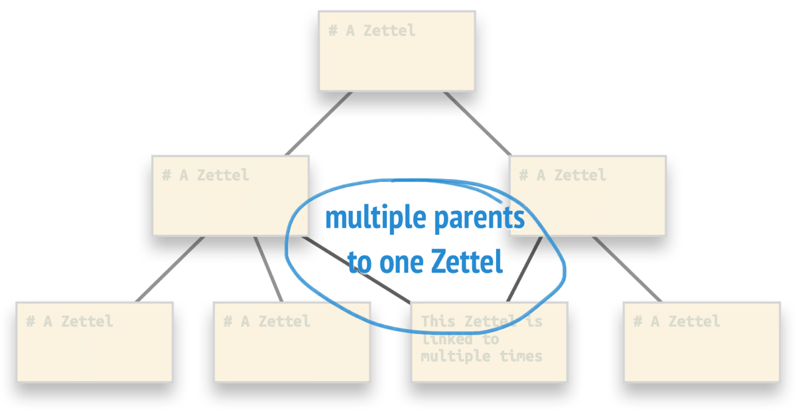

# Zettelkasten Structure Image

Reference: 

Key words:
- Strcuture Zettels

It's a kind of strcuture that you could imagine when thing interconections between hubs and zettels. Structure Notes are not limited to hierarchical structures like the nested list from above. Structure notes can also have sequential structures. Imagine the following line of argumentation: a -> b -> c, therefore a -> c. 